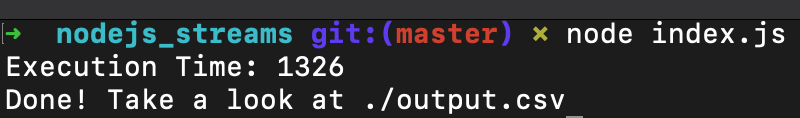

# Performance study using nodejs streams

# Benchmark:

macOS Big Sur
Version 11.5.2 (20G95)
MacBook Pro (13-inch, 2017, Two Thunderbolt 3 ports)
Processor 2,3 GHz Intel Core i5 Dual-Core
Memory 8 GB 2133 MHz LPDDR3
Graphics Intel Iris Plus Graphics 640 1536 MB

Node 14.17.4

source.json - 88,6 Mb

Execution time: 1326 milliseconds

